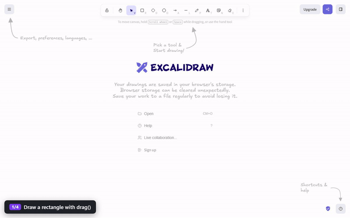
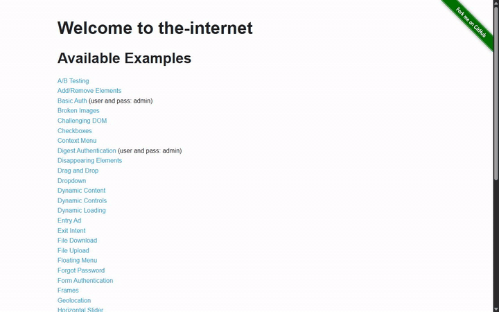
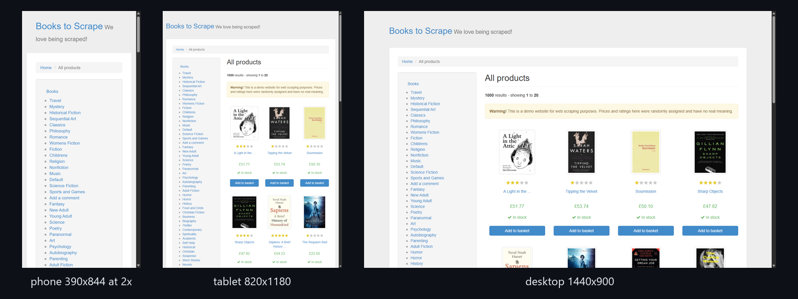

# Showcase

Real runs, recorded with BrowserGlass's own session recorder from throwaway headless browsers. Each one is a script in [`examples/showcase`](../examples/showcase).

## Running them

Start a gateway with a recordings folder, then run any script from the repo root:

```sh
pnpm bgls serve --listen 127.0.0.1:7799 --recordings-dir ./bgls-recordings

# in a second terminal, same folder
export BGLS_ADMIN_TOKEN=$(pnpm -s bgls token --ttl 900)
export BGLS_RECORDINGS_DIR=./bgls-recordings
node examples/showcase/books-to-csv.mjs
```

Each script prints what it found, writes its data to `examples/showcase/out/`, and saves a fresh GIF of its own run to `docs/media/showcase/`. That last step needs ffmpeg on your PATH. [`examples/showcase/lib/showcase.mjs`](../examples/showcase/lib/showcase.mjs) holds the recording and caption helpers if you want the same thing for your own automation.

## Export a book catalog to CSV

<sub>books.toscrape.com · Data extraction</sub>


Reads title, price, star rating and stock from three catalog pages, clicking Next each time, and writes `out/books.csv`.

```sh
node examples/showcase/books-to-csv.mjs
```

## Collect every quote for a tag

<sub>quotes.toscrape.com · Data extraction</sub>


Opens a tag, follows Next through every page of it, and writes each quote and author to `out/quotes.json`.

```sh
node examples/showcase/quotes-by-tag.mjs
```

## Compare four languages in a table

<sub>wikipedia.org · Data extraction</sub>


Visits the Wikipedia articles for Python, Rust, Go and TypeScript, reads two infobox fields from each, and shows the collected table. Writes `out/languages.csv`.

```sh
node examples/showcase/infobox-table.mjs
```

## Research a topic into notes

<sub>wikipedia.org · Research</sub>


Types a search like a person, opens the article, and turns its lead paragraph and section headings into `out/web-scraping.md`.

```sh
node examples/showcase/wikipedia-research.mjs
```

## Pull the latest releases

<sub>github.com/microsoft/vscode · Research</sub>


Reads the five newest release names and dates from a public project page and writes `out/releases.json`.

```sh
node examples/showcase/github-releases.mjs
```

## Log in, fill a cart, check out

<sub>saucedemo.com · Forms and checkout</sub>


Logs in with the demo account the site publishes, adds two products, checks out with made up details and ends on the order confirmation.

```sh
node examples/showcase/demo-shop-checkout.mjs
```

## Upload a file through a form

<sub>the-internet.herokuapp.com · Forms and checkout</sub>


Creates a small text file, attaches it with `setInputFiles`, submits, and ends on the upload confirmation.

```sh
node examples/showcase/file-upload.mjs
```

## Add, complete and filter todos

<sub>TodoMVC demo · Testing and QA</sub>


Adds five todos, completes two, switches the filter to Active and checks what is left.

```sh
node examples/showcase/todo-app.mjs
```

## Nine browsers live in one page

<sub>nine sites at once · Parallel</sub>


Opens nine browsers with `BrowserSwarm`, shows all nine streams live in one page of `<browser-glass>` tags, and has every one of them browse a different site at the same time.

```sh
node examples/showcase/nine-browsers-live.mjs
```

## An MCP agent drives the browser

<sub>wikipedia.org · Agent workflows</sub>


An MCP client starts `bgls mcp` and calls tools the way an agent would: take control, navigate, read the page map, fill the search box, read the page.

```sh
node examples/showcase/mcp-agent.mjs
```

## Take a typing test, key by key

<sub>typings.gg · Games and real time</sub>


Reads the next word off the page and types it one key at a time, the way a person would.

```sh
node examples/showcase/typing-test.mjs
```

## Play 2048 with arrow keys

<sub>play2048.co · Games and real time</sub>


Plays a round with arrow key presses and reads the score off the page as it goes.

```sh
node examples/showcase/play-2048.mjs
```

## Block images and CSS, crawl 2.5x faster

<sub>books.toscrape.com · Data extraction</sub>


Loads the same catalog page twice, once normally and once with request gate rules that deny images and stylesheets, and compares load time and bytes from the page's own Performance API. On the recorded run: 2.43 s and 332 KB normally, 0.96 s and 75 KB blocked.

```sh
node examples/showcase/block-images.mjs
```
## Draw on a canvas with drag()

<sub>excalidraw.com · Games and real time</sub>



Picks the rectangle, ellipse and arrow tools and draws each one with `drag()`, which holds the mouse button down while it moves, then labels the drawing with the text tool.

```sh
node examples/showcase/draw-canvas.mjs
```

## Smoke test seven pages, report PASS/FAIL

<sub>the-internet.herokuapp.com · Testing and QA</sub>



Visits seven example pages one after another, checks one thing on each (checkboxes, a dropdown, a 404 status page, broken images, inputs, key presses, adding and removing elements), saves a screenshot of each, and ends on a PASS/FAIL table drawn into the page. Writes `out/smoke-report.json`. Broken Images fails on purpose: that page is built to have broken images.

```sh
node examples/showcase/smoke-test.mjs
```

## Phone, tablet and desktop screenshots

<sub>books.toscrape.com · Testing and QA</sub>



Opens the same page at 390x844 (2x), 820x1180 and 1440x900 using the `viewport` launch option, and saves one screenshot per size.

```sh
node examples/showcase/responsive-screenshots.mjs
```
